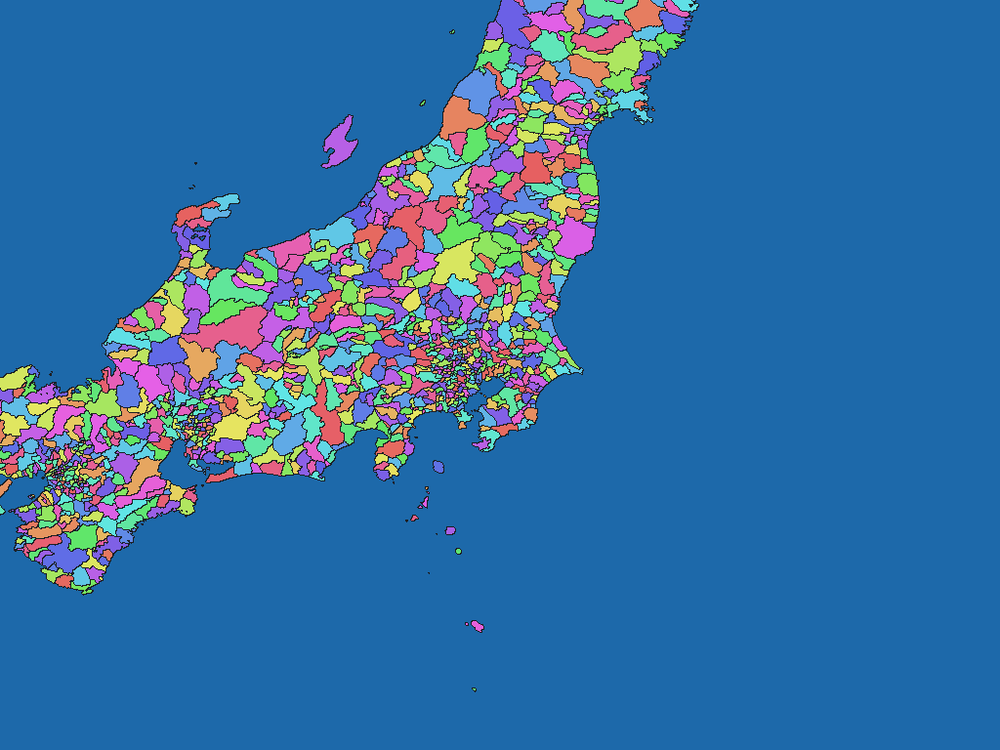
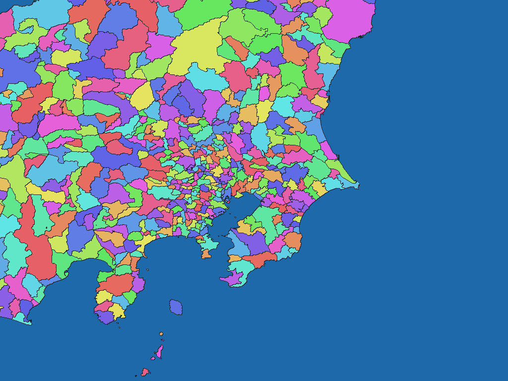
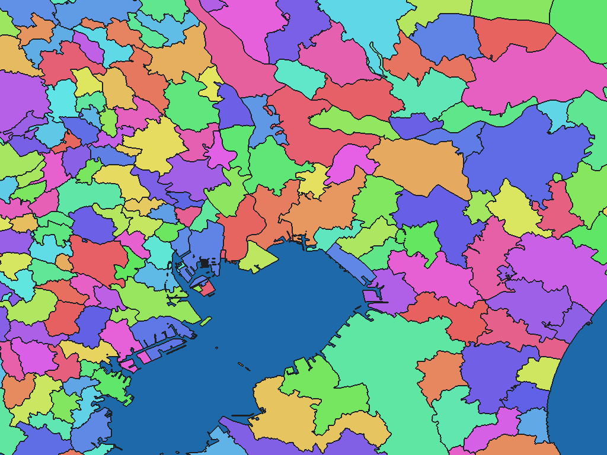
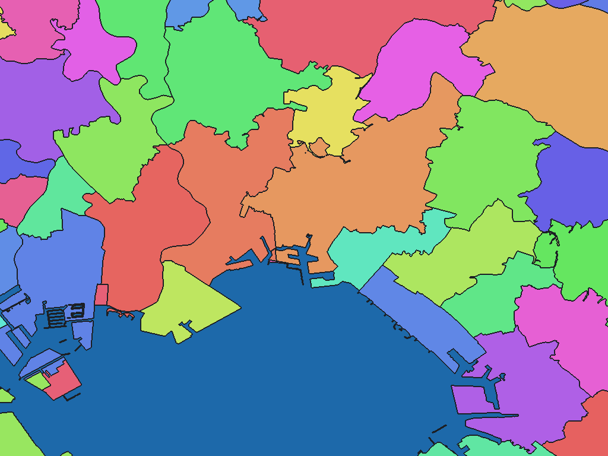
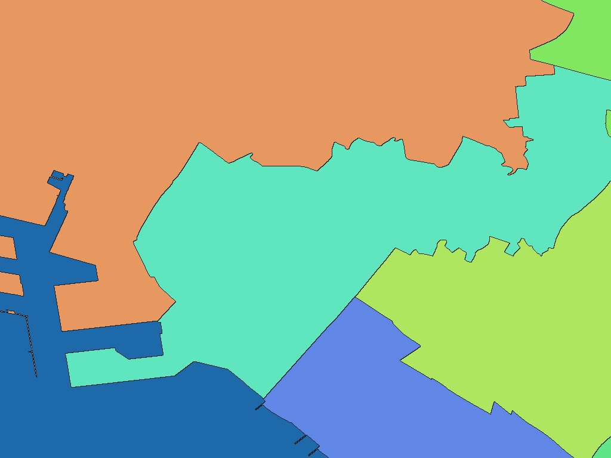
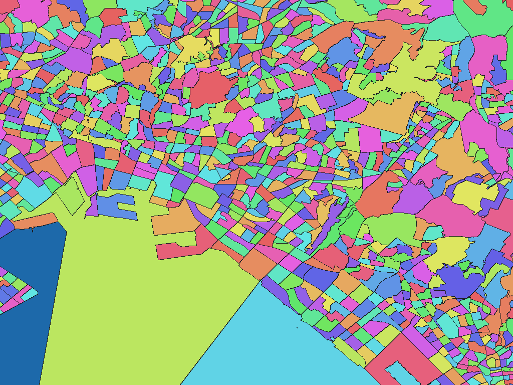
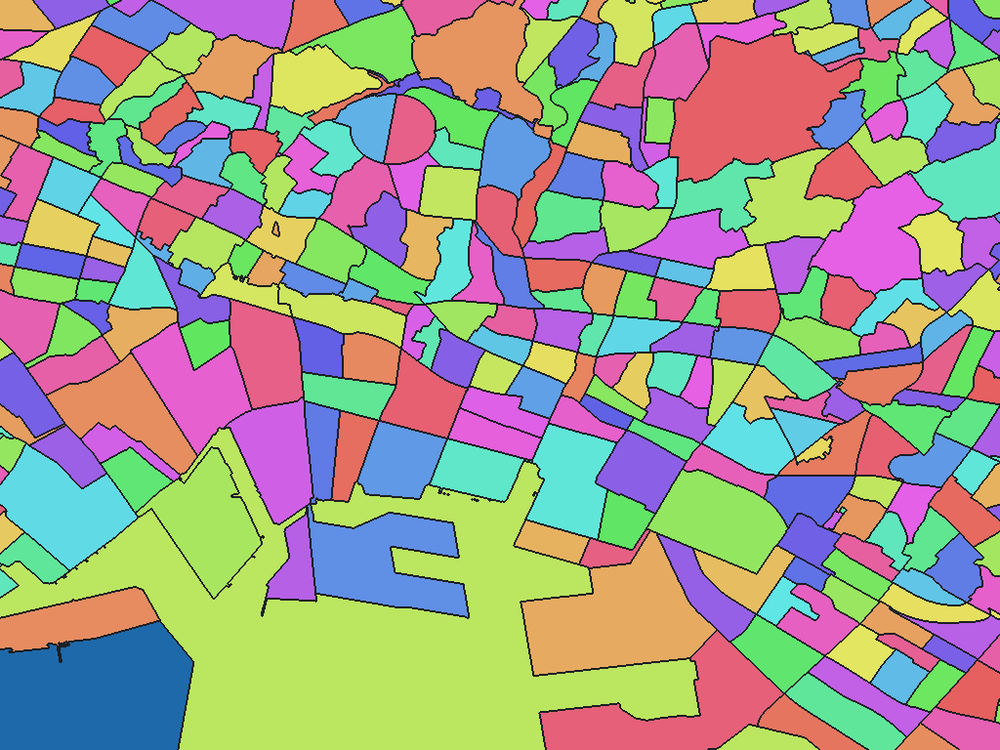
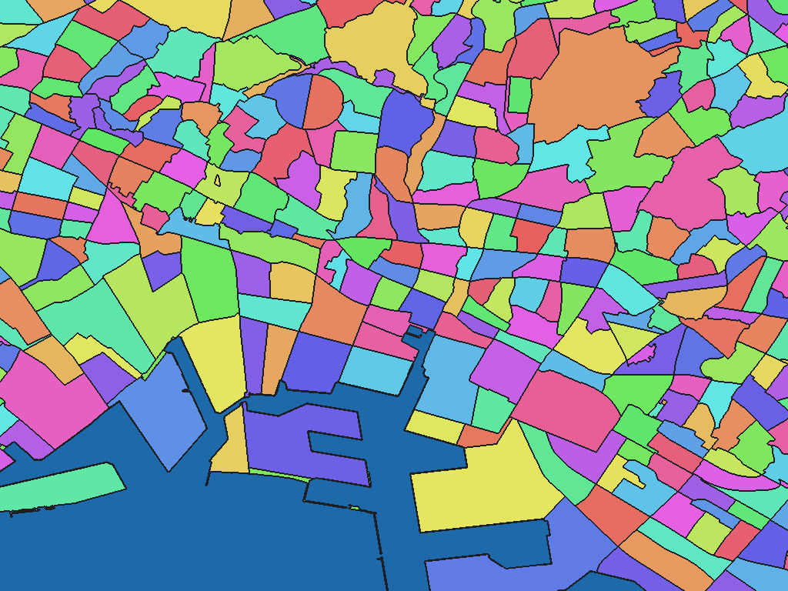
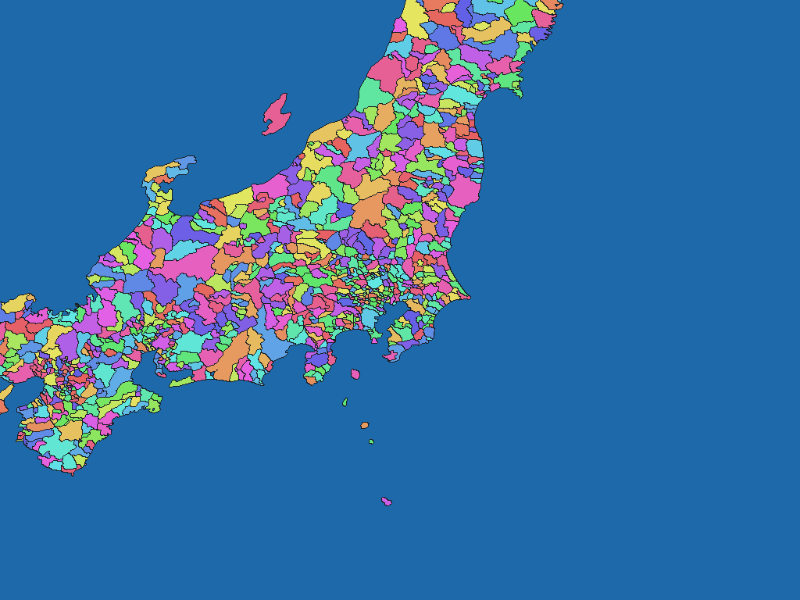
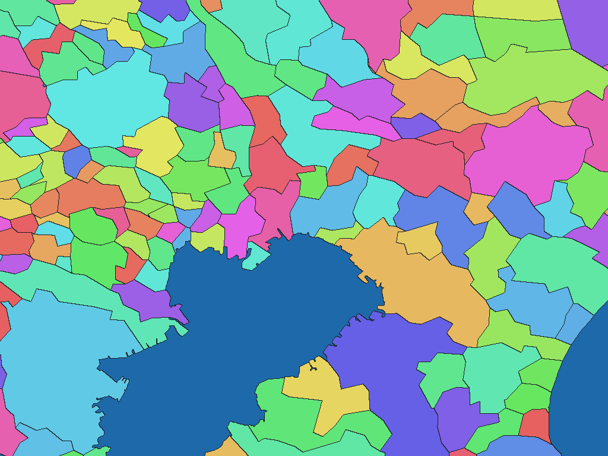

# Galuchat GIS SDK データセット

[English](README.md) | 日本語

`datasets/`には、JavaScript・Java・Python・C++で共通利用するWGSMapSet/3とGisWordBook/0を収録します。

各datasetディレクトリには次のファイルがあります。

```text
manifest.json          解像度、文字コード、default、サイズ、SHA-256
NOTICE.md              出典、加工内容、利用条件
X7115_metadata.xml     JMP 2.0形式の履歴メタデータ（該当dataset）
*.wgsmapset.glc        地点・矩形から地域コードを読むmap
*.giswordbook          地域コードから地名階層を読むWordBook
```

mapとWordBookは必ず同じdatasetの組み合わせで使用してください。複数解像度のmapは同じ値コード体系を共有します。文字コード別WordBookも内容と地名コードは共通で、UTF-8版をdefaultとします。

3年度の`jp-admin-n03`と`jp-gis-estat-integrated`には、原資料と加工履歴を記録したJMP 2.0形式の`X7115_metadata.xml`を収録します。

現在の標準ReaderとGet StartedはUTF-8版を使用します。Shift_JIS版とUTF-16版は、対応するReaderでmanifestの`tokenEncoding`を指定して利用します。

## 収録データセット

SDKには、基準日・用途・空間粒度の異なる6つのGISデータセット版を収録しています。

| dataset id | 対象 | 主な用途 | 収録解像度（unitInv） |
| --- | --- | --- | --- |
| `jp-admin-n03-2024` | 日本の行政区域（2024年） | 都道府県、市区町村、政令市区の判定 | 100、250、1000、2500、10000 |
| `jp-admin-n03-2025` | 日本の行政区域（2025年） | 2025年1月1日時点の行政区域判定 | 100、1000、10000 |
| `jp-admin-n03-2026` | 日本の行政区域（2026年） | 2026年1月1日時点の行政区域判定 | 100、1000、10000 |
| `jp-estat-r2ka-2020` | 日本の町丁・字等境界 | 町丁、小地区レベルの判定 | 5000、10000 |
| `jp-gis-estat-integrated` | 行政区域と町丁・字等境界の統合 | 行政区域から小地区までの一体的な逆ジオコーディング | 10000 |
| `world-geoboundaries-cgaz` | 世界の行政境界 | 世界規模の国・行政区域判定 | 100、1000 |

`unitInv`は1度を何画素に分割するかを表します。例えば`unitInv=1000`では、1画素が緯度・経度方向の1/1000度に相当します。

## レンダリング例の見方

以下の画像は、すべて船橋付近（東経139.9825度、北緯35.6947度）を中心として、WGSMapSetから1024×768画素を読み出したものです。

GLCの1画素を画像の1画素へ対応させ、拡大・縮小は行っていません。このため、解像度の低いデータほど広い地域が写り、解像度の高いデータほど船橋周辺を詳細に表示します。

画素値`0`は海面などの未設定領域として青色で表示します。正の画素値は地域コードであり、コードの違いを認識できるようHSV色空間を使って塗り分けています。表示色自体に行政上の意味はありません。

| unitInv | 1画素の緯度方向の目安 | 画像に写る経緯度範囲 |
| ---: | ---: | ---: |
| 100 | 約1.1 km | 10.24 × 7.68度 |
| 250 | 約445 m | 4.096 × 3.072度 |
| 1000 | 約111 m | 1.024 × 0.768度 |
| 2500 | 約45 m | 0.4096 × 0.3072度 |
| 5000 | 約22 m | 0.2048 × 0.1536度 |
| 10000 | 約11 m | 0.1024 × 0.0768度 |

距離は緯度方向の概算です。経度方向の実距離は緯度によって変化します。画像をクリックすると原寸で表示できます。

## データサイズと選び方

解像度を高くすると境界や海岸線を細かく表現できますが、GLCのファイルサイズも増加します。必要な空間粒度、配布容量、保存領域を考慮して選択してください。

| dataset | unitInv | GLCサイズ |
| --- | ---: | ---: |
| `jp-admin-n03-2024` | 100 | 約52 KiB |
|  | 250 | 約123 KiB |
|  | 1000 | 約479 KiB |
|  | 2500 | 約1.17 MiB |
|  | 10000 | 約4.48 MiB |
| `jp-admin-n03-2025` | 100 | 約52 KiB |
|  | 1000 | 約479 KiB |
|  | 10000 | 約4.48 MiB |
| `jp-admin-n03-2026` | 100 | 約52 KiB |
|  | 1000 | 約479 KiB |
|  | 10000 | 約4.47 MiB |
| `jp-estat-r2ka-2020` | 5000 | 約12.94 MiB |
|  | 10000 | 約22.70 MiB |
| `jp-gis-estat-integrated` | 10000 | 約24.07 MiB |
| `world-geoboundaries-cgaz` | 100 | 約2.81 MiB |
|  | 1000 | 約20.45 MiB |

地名階層を取得する場合は、GLCに加えて同じdatasetのGisWordBookを使用します。標準Readerが使用するUTF-8版のサイズは次の通りです。

| dataset | UTF-8 GisWordBookサイズ |
| --- | ---: |
| `jp-admin-n03-2024` | 約31 KiB |
| `jp-admin-n03-2025` | 約31 KiB |
| `jp-admin-n03-2026` | 約31 KiB |
| `jp-estat-r2ka-2020` | 約1.63 MiB |
| `jp-gis-estat-integrated` | 約1.66 MiB |
| `world-geoboundaries-cgaz` | 約561 KiB |

通常は、用途に合うGLCを1つと、必要な文字コードのGisWordBookを1つ選択すれば利用できます。複数解像度を切り替える場合を除き、すべてのGLCと全文字コードのGisWordBookをアプリケーションへ含める必要はありません。

上記は現在収録しているファイルの概算サイズです。正確なbyte数、default指定、SHA-256は各datasetの`manifest.json`を参照してください。ファイルサイズは配布・保存容量の目安であり、Readerや利用環境の実行時メモリ使用量を表すものではありません。

## 日本行政区域（jp-admin-n03系）

国土交通省「国土数値情報 行政区域データ N03」を基にしたデータセットです。

都道府県、市区町村、郡、政令市区などの行政区域を判定できます。`jp-admin-n03-2024`は2024年1月1日版を5段階の解像度で収録します。`jp-admin-n03-2025`と`jp-admin-n03-2026`は各年1月1日版を`unitInv=100`、`1000`、`10000`で収録します。

<table>
  <tr>
    <th>unitInv 100</th>
    <th>unitInv 250</th>
    <th>unitInv 1000</th>
  </tr>
  <tr>
    <td><a href="../docs/image/jp-admin-n03-unit-inv-100.png"></a></td>
    <td><a href="../docs/image/jp-admin-n03-unit-inv-250.png"></a></td>
    <td><a href="../docs/image/jp-admin-n03-unit-inv-1000.png"></a></td>
  </tr>
  <tr>
    <th>unitInv 2500</th>
    <th>unitInv 10000</th>
    <th></th>
  </tr>
  <tr>
    <td><a href="../docs/image/jp-admin-n03-unit-inv-2500.png"></a></td>
    <td><a href="../docs/image/jp-admin-n03-unit-inv-10000.png"></a></td>
    <td></td>
  </tr>
</table>

`unitInv=100`は日本を広域に俯瞰でき、`unitInv=1000`では東京湾周辺、`unitInv=10000`では港湾部などの細かな行政区域形状を確認できます。

上の画像は2024年版の表示例です。出典と利用条件は、[2024年版](jp-admin-n03-2024/NOTICE.md)、[2025年版](jp-admin-n03-2025/NOTICE.md)、[2026年版](jp-admin-n03-2026/NOTICE.md)の各NOTICEを確認してください。

## e-Stat町丁・字等境界（jp-estat-r2ka-2020）

総務省統計局「令和2年国勢調査 町丁・字等境界データ」を基にしたデータセットです。

行政区域より細かな統計区域を収録しており、町丁、小地区、下位地区レベルの逆ジオコーディングに利用できます。境界は統計調査用であり、一般的な行政区域や住居表示と一致するとは限りません。

<table>
  <tr>
    <th>unitInv 5000</th>
    <th>unitInv 10000</th>
  </tr>
  <tr>
    <td><a href="../docs/image/jp-estat-r2ka-2020-unit-inv-5000.png"></a></td>
    <td><a href="../docs/image/jp-estat-r2ka-2020-unit-inv-10000.png"></a></td>
  </tr>
</table>

N03と比較すると細かな領域が多数収録されており、データの空間粒度の違いを確認できます。

出典と利用条件は[jp-estat-r2ka-2020 NOTICE](jp-estat-r2ka-2020/NOTICE.md)を確認してください。

## GIS・e-Stat統合データ（jp-gis-estat-integrated）

N03の行政区域とe-Statの町丁・字等境界を統合したデータセットです。

都道府県、市区町村などの行政階層と、町丁・小地区の階層を、ひとつのGisWordBookから取得できます。e-Statに小地区が定義されていない陸域は、N03の行政区域情報によって補完しています。

<a href="../docs/image/jp-gis-estat-integrated-unit-inv-10000.png"></a>

行政区域から小地区までを一体的に扱う場合の標準的なデータセットです。

出典と利用条件は[jp-gis-estat-integrated NOTICE](jp-gis-estat-integrated/NOTICE.md)を確認してください。

## 世界行政境界（world-geoboundaries-cgaz）

geoBoundaries CGAZの世界行政境界を基にしたデータセットです。

世界規模の地点判定に利用できます。地域ごとに利用可能なADM2、ADM1、ADM0または係争地域の境界から、最も詳細な境界を選択して収録しています。

<table>
  <tr>
    <th>unitInv 100</th>
    <th>unitInv 1000</th>
  </tr>
  <tr>
    <td><a href="../docs/image/world-geoboundaries-cgaz-unit-inv-100.png"></a></td>
    <td><a href="../docs/image/world-geoboundaries-cgaz-unit-inv-1000.png"></a></td>
  </tr>
</table>

`unitInv=100`は広域を少ない画素数で参照する用途に、`unitInv=1000`は地域レベルの行政境界や海岸線をより詳細に参照する用途に向きます。

出典と利用条件は[world-geoboundaries-cgaz NOTICE](world-geoboundaries-cgaz/NOTICE.md)を確認してください。
