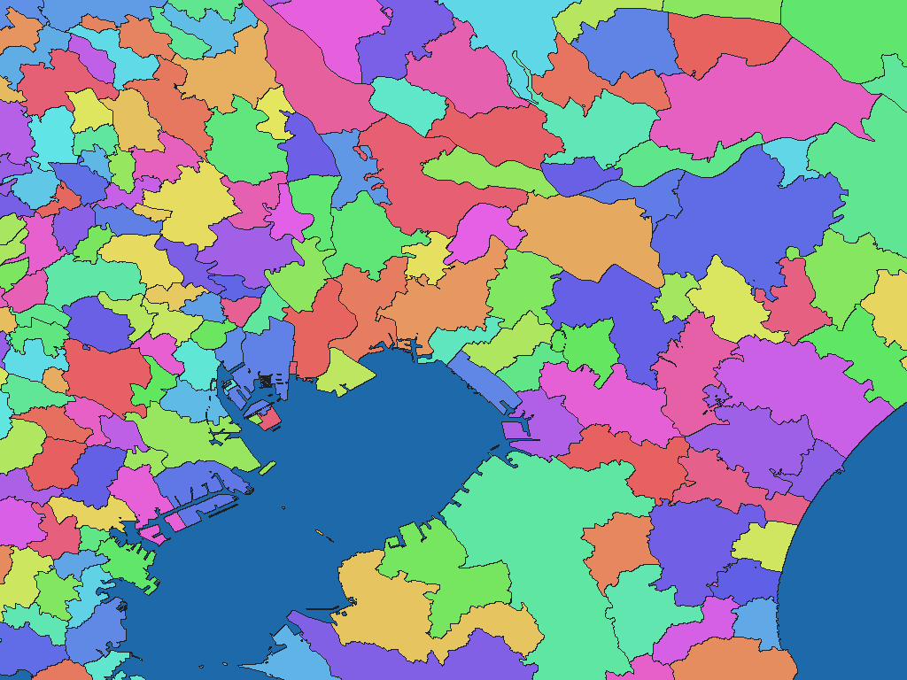
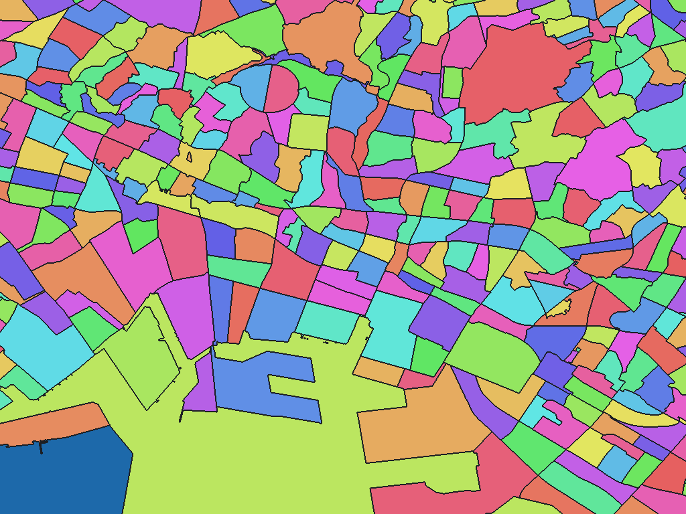
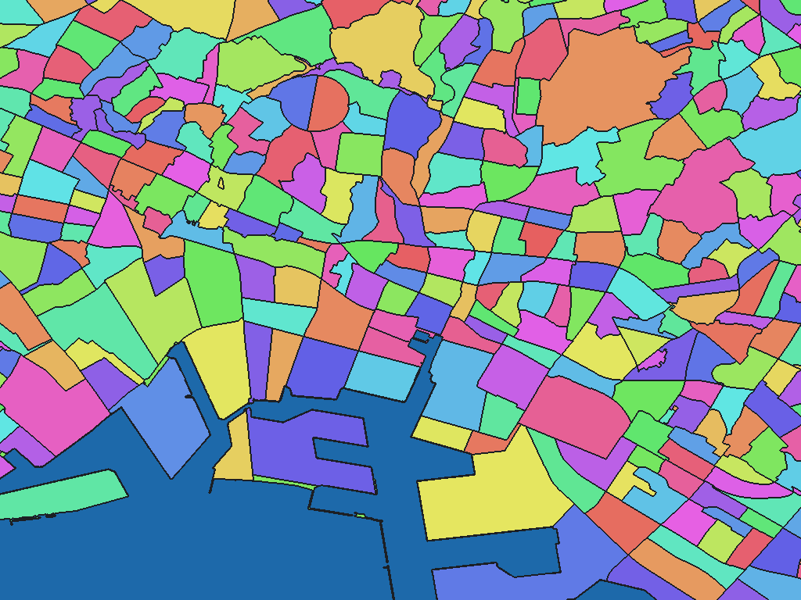
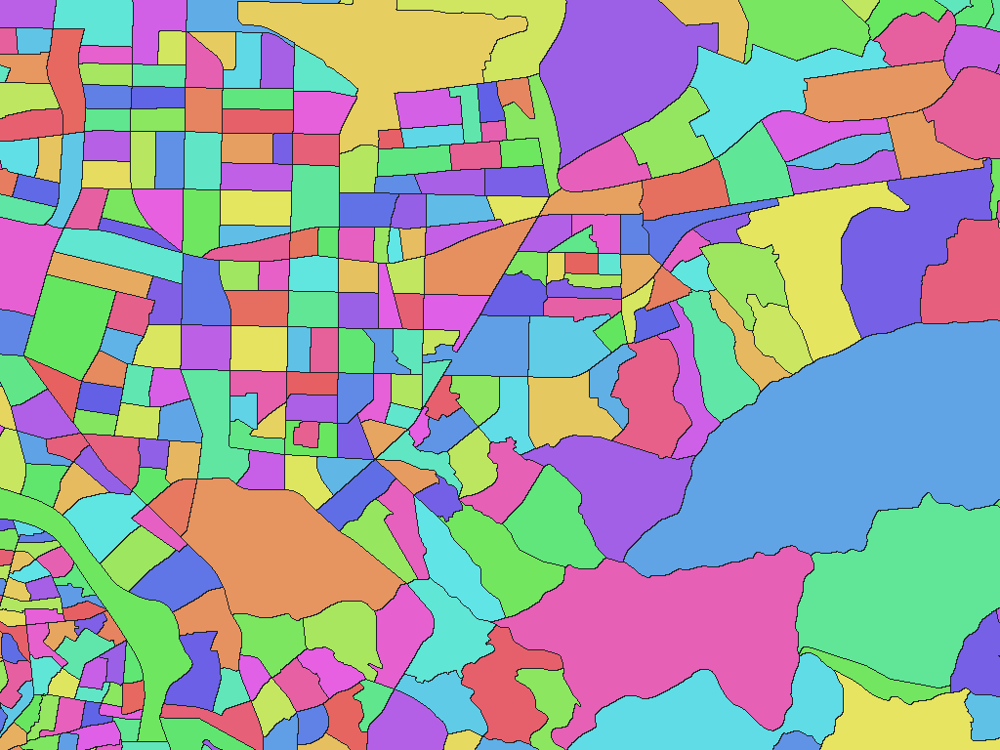
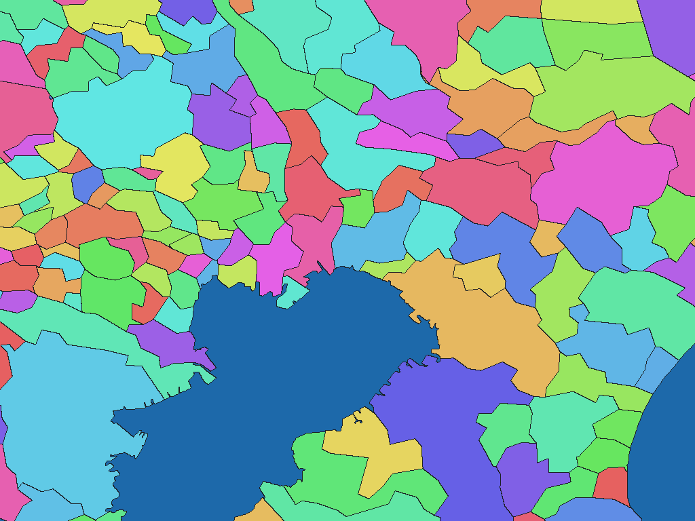

# Galuchat GIS SDK データセット

[English](README.md) | 日本語

Galuchat GIS SDK用のデータセットは、[GitHub Release v0.1.2](https://github.com/nyatla/galuchat-gis-sdk/releases/tag/v0.1.2)からZIP形式でダウンロードできます。SDKに同梱された2026年版の行政区域データ以外を使用する場合は、必要なデータセットを個別にダウンロードしてください。

各ZIPには、WGSMapSet、GisWordBook、出典と利用条件を記載した`NOTICE.md`が入っています。WGSMapSetとGisWordBookは、必ず同じZIPに収録された組み合わせで使用してください。通常は用途に合うWGSMapSetを1つと、UTF-8版のGisWordBookを使用します。

表示しているZIPサイズはGitHub Releaseへ配置するファイルのサイズです。各ファイルのサイズは概算であり、実行時のメモリ使用量ではありません。

## 日本行政区域 2024年版

国土交通省「国土数値情報 行政区域データ N03」の2024年1月1日版です。都道府県、市区町村、郡、政令市区などの行政区域を判定できます。過年度の行政区域を参照する用途に適しています。

[jp-admin-n03-2024.20260907.zipをダウンロード（約6.05 MiB）](https://github.com/nyatla/galuchat-gis-sdk/releases/download/v0.1.2/jp-admin-n03-2024.20260907.zip)

| unitInv | 1画素の緯度方向の目安 | WGSMapSetサイズ |
| ---: | ---: | ---: |
| 100 | 約1.1 km | 約52 KiB |
| 250 | 約445 m | 約123 KiB |
| 1000（標準） | 約111 m | 約479 KiB |
| 2500 | 約45 m | 約1.17 MiB |
| 10000 | 約11 m | 約4.48 MiB |

UTF-8、Shift_JIS、UTF-16のGisWordBookを収録し、それぞれ約31 KiBです。

画像は`unitInv=1000`で習志野市付近を表示した例です。出典、加工内容、利用条件はZIP内の`NOTICE.md`を確認してください。

## 日本行政区域 2025年版

国土交通省「国土数値情報 行政区域データ N03」の2025年1月1日版です。2025年時点の都道府県、市区町村、郡、政令市区などを判定できます。

[jp-admin-n03-2025.20260907.zipをダウンロード（約8.47 MiB）](https://github.com/nyatla/galuchat-gis-sdk/releases/download/v0.1.2/jp-admin-n03-2025.20260907.zip)

| unitInv | 1画素の緯度方向の目安 | WGSMapSetサイズ |
| ---: | ---: | ---: |
| 100 | 約1.1 km | 約52 KiB |
| 250 | 約445 m | 約123 KiB |
| 500 | 約222 m | 約241 KiB |
| 1000（標準） | 約111 m | 約479 KiB |
| 2500 | 約45 m | 約1.17 MiB |
| 5000 | 約22 m | 約2.30 MiB |
| 10000 | 約11 m | 約4.48 MiB |

UTF-8、Shift_JIS、UTF-16のGisWordBookを収録し、それぞれ約31 KiBです。

画像は`unitInv=1000`で習志野市付近を表示した例です。出典、加工内容、利用条件はZIP内の`NOTICE.md`を確認してください。

## 日本行政区域 2026年版

国土交通省「国土数値情報 行政区域データ N03」の2026年1月1日版です。通常の行政区域判定には、この最新版を推奨します。SDKのGet Startedもこのデータセットを使用します。

[jp-admin-n03-2026.20260907.zipをダウンロード（約8.47 MiB）](https://github.com/nyatla/galuchat-gis-sdk/releases/download/v0.1.2/jp-admin-n03-2026.20260907.zip)

| unitInv | 1画素の緯度方向の目安 | WGSMapSetサイズ |
| ---: | ---: | ---: |
| 100 | 約1.1 km | 約52 KiB |
| 250 | 約445 m | 約123 KiB |
| 500 | 約222 m | 約240 KiB |
| 1000（標準） | 約111 m | 約479 KiB |
| 2500 | 約45 m | 約1.17 MiB |
| 5000 | 約22 m | 約2.30 MiB |
| 10000 | 約11 m | 約4.47 MiB |

UTF-8、Shift_JIS、UTF-16のGisWordBookを収録し、それぞれ約31 KiBです。

画像は`unitInv=1000`で習志野市付近を表示した例です。出典、加工内容、利用条件はZIP内の`NOTICE.md`を確認してください。

## e-Stat町丁・字等境界 2020年版

総務省統計局「令和2年国勢調査 町丁・字等境界データ」を基にしたデータセットです。行政区域より細かな町丁、小地区、下位地区レベルの逆ジオコーディングに使用できます。統計調査用の境界であり、一般的な行政区域や住居表示と一致するとは限りません。

[jp-estat-r2ka-2020.20260907.zipをダウンロード（約37.09 MiB）](https://github.com/nyatla/galuchat-gis-sdk/releases/download/v0.1.2/jp-estat-r2ka-2020.20260907.zip)

| unitInv | 1画素の緯度方向の目安 | WGSMapSetサイズ |
| ---: | ---: | ---: |
| 5000 | 約22 m | 約12.94 MiB |
| 10000（標準） | 約11 m | 約22.70 MiB |

UTF-8、Shift_JIS、UTF-16のGisWordBookを収録し、それぞれ約1.63 MiBです。

画像は`unitInv=10000`で習志野市付近を表示した例です。出典、加工内容、利用条件はZIP内の`NOTICE.md`を確認してください。

## GIS・e-Stat統合データ

N03の行政区域とe-Statの町丁・字等境界を統合したデータセットです。都道府県、市区町村から町丁、小地区までを、ひとつのGisWordBookで取得できます。行政区域から小地区まで一体的に逆ジオコーディングしたい場合に適しています。

[jp-gis-estat-integrated.20260907.zipをダウンロード（約26.06 MiB）](https://github.com/nyatla/galuchat-gis-sdk/releases/download/v0.1.2/jp-gis-estat-integrated.20260907.zip)

| unitInv | 1画素の緯度方向の目安 | WGSMapSetサイズ |
| ---: | ---: | ---: |
| 10000（標準） | 約11 m | 約24.07 MiB |

UTF-8、Shift_JIS、UTF-16のGisWordBookを収録し、それぞれ約1.66 MiBです。

画像は`unitInv=10000`で習志野市付近を表示した例です。出典、加工内容、利用条件はZIP内の`NOTICE.md`を確認してください。

## 台湾村里界 2026年版

台湾の內政部國土測繪中心（NLSC）が公開する2026年8月17日版の村里界圖を基にしたデータセットです。繁体字の地名を`[縣市, 鄉鎮市區, 村里]`の3階層で取得できます。原典で村里名がない領域は「未編定村里」として収録しています。

[tw-admin-nlsc-village-2026.20260907.zipをダウンロード（約1.51 MiB）](https://github.com/nyatla/galuchat-gis-sdk/releases/download/v0.1.2/tw-admin-nlsc-village-2026.20260907.zip)

| unitInv | 1画素の緯度方向の目安 | WGSMapSetサイズ |
| ---: | ---: | ---: |
| 100 | 約1.1 km | 約26 KiB |
| 1000（標準） | 約111 m | 約202 KiB |
| 10000 | 約11 m | 約1.27 MiB |

UTF-8版（約57 KiB）とUTF-16版（約56 KiB）のGisWordBookを収録しています。

画像は`unitInv=10000`で台北市付近を表示した例です。出典、加工内容、利用条件はZIP内の`NOTICE.md`を確認してください。

## 英国地方自治体地区 2025年12月版

英国国家統計局（ONS）の「Local Authority Districts (December 2025) Boundaries UK BFC」を基にしたデータセットです。イングランド、スコットランド、ウェールズ、北アイルランドを対象とし、英語名を`[構成国, カウンティまたは空文字列, 地方自治体地区]`の3階層で取得できます。

[uk-admin-ons-lad-2025.20260907.zipをダウンロード（約2.35 MiB）](https://github.com/nyatla/galuchat-gis-sdk/releases/download/v0.1.2/uk-admin-ons-lad-2025.20260907.zip)

| unitInv | 1画素の緯度方向の目安 | WGSMapSetサイズ |
| ---: | ---: | ---: |
| 100 | 約1.1 km | 約20 KiB |
| 1000（標準） | 約111 m | 約211 KiB |
| 10000 | 約11 m | 約2.23 MiB |

UTF-8版とUTF-16版のGisWordBookを収録し、それぞれ約6.2 KiBです。

画像は`unitInv=1000`でロンドン付近を表示した例です。出典、加工内容、利用条件はZIP内の`NOTICE.md`を確認してください。

## 世界行政境界

geoBoundaries CGAZを基にした世界行政境界データセットです。各地域で利用可能なADM2、ADM1、ADM0または係争地域のうち、最も詳細な境界を収録しています。世界規模の国・行政区域判定に使用できます。

[world-geoboundaries-cgaz.20260907.zipをダウンロード（約22.92 MiB）](https://github.com/nyatla/galuchat-gis-sdk/releases/download/v0.1.2/world-geoboundaries-cgaz.20260907.zip)

| unitInv | 1画素の緯度方向の目安 | WGSMapSetサイズ |
| ---: | ---: | ---: |
| 100 | 約1.1 km | 約2.81 MiB |
| 1000（標準） | 約111 m | 約20.45 MiB |

UTF-8版とUTF-16版のGisWordBookを収録し、それぞれ約561 KiBです。

画像は`unitInv=1000`の表示例です。出典、加工内容、利用条件はZIP内の`NOTICE.md`を確認してください。

## 解像度の選び方

`unitInv`は1度を何画素に分割するかを表します。値が大きいほど境界や海岸線を細かく表現できますが、ファイルサイズも大きくなります。

| unitInv | 1画素の緯度方向の目安 |
| ---: | ---: |
| 100 | 約1.1 km |
| 250 | 約445 m |
| 500 | 約222 m |
| 1000 | 約111 m |
| 2500 | 約45 m |
| 5000 | 約22 m |
| 10000 | 約11 m |

距離は緯度方向の概算です。経度方向の実距離は緯度によって変化します。高解像度にしても、市区町村から町丁へ変わるように地域コードの粒度が細かくなるわけではありません。必要な地域階層を持つデータセットを選んだうえで、境界精度とファイルサイズのバランスから解像度を選択してください。
