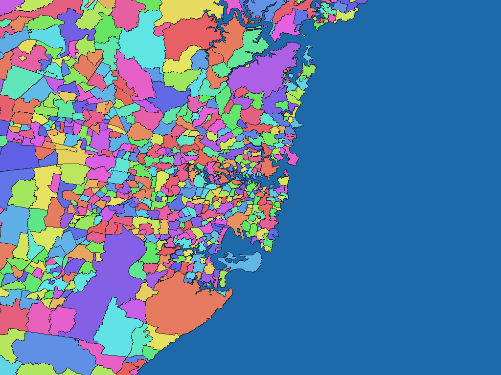

# オーストラリアSuburb・Locality 2021年版

[English](au-2021-abs-gov-au-sal-stat-sal.md) | 日本語

[データセット一覧へ戻る](../../datasets/README.ja.md)

## 概要

Australian Bureau of Statistics（ABS）のAustralian Statistical Geography Standard（ASGS）Edition 3、Suburbs and Localities（SAL）2021から、オーストラリアのsuburb・localityを表す区域図と名称辞書を収録する。SALは公的に定められた地名区域をABSがMesh Blockで近似した統計用区域であり、法的境界そのものではない。区域図の非ゼロ画素値は同梱GisWordBookのコードである。

## 区域数

区域数（辞書コード単位）は **15,334件** です。これはGisWordBookの葉レコード数であり、上位区域数・ポリゴン数・各解像度で実際に画素化される区域数ではありません。

採用するSALは15,334区域です。原典15,353レコードのうち、空間形状を持たない特別用途コード19件を除外しています。

## ダウンロード

[ダウンロード au-2021-abs-gov-au-sal-stat-sal.zip (15.60 MiB)](https://github.com/nyatla/galuchat-gis-sdk/releases/download/v0.2.1/au-2021-abs-gov-au-sal-stat-sal.zip)

## 地図の解像度とサイズ

| unitInv | 1画素の目安 | WGSMapSetサイズ |
| ---: | ---: | ---: |
| 100 | 約1.1 km | 315.9 KiB |
| 1000（標準） | 約111 m | 2.02 MiB |
| 10000 | 約11 m | 13.47 MiB |

## 名称辞書

| GisWordBook文字コード | サイズ |
| --- | ---: |
| UTF-8 | 179.8 KiB |
| UTF-16LE | 179.8 KiB |

原典の区域識別子との対応は同梱の `names.csv` を参照してください。

### GisWordBookの構造

各レコードは2スロットの固定長StringSetです。下表の順に値が並びます。空欄は `""` として保持し、後続スロットを前へ詰めません。

| スロット | 意味 | 省略可否 |
| --- | --- | --- |
| 区域1 | 原典の英語`STE_NAME21`。州・準州またはOther Territoriesの名称。 | 不可 |
| 区域2 | 原典の英語`SAL_NAME21`。suburbまたはlocalityの名称。 | 不可 |

共通の`Australia`ノードは含めず、空スロットも設けない。採用区域では、区域1と区域2の組で名称パスを区別できる。

実データの例（辞書コード `3866`）：

```json
["New South Wales","Sydney"]
```

地図の非ゼロ値が辞書コードです。この例は葉レコードの0始まりインデックス `3865` に対応します。コード `0` は未設定領域で、辞書レコードではありません。

## 表示例

<a href="../../docs/image/au-abs-asgs-sal-2021-unit-inv-1000.png"></a>

シドニー周辺を中心に、`unitInv=1000` の地図を描画しています。青色は未設定領域、その他の色は区域コードを表します。色自体に意味はありません。

## ライセンスと利用条件

原典：Australian Bureau of Statistics（ABS）[ASGS Edition 3デジタル境界ファイル](https://www.abs.gov.au/statistics/standards/australian-statistical-geography-standard-asgs/edition-3-july-2021-june-2026/access-and-downloads/digital-boundary-files)

原典ライセンス・利用条件：[CC BY 4.0](https://creativecommons.org/licenses/by/4.0/)、[ABS著作権・ライセンス案内](https://www.abs.gov.au/website-privacy-copyright-and-disclaimer)

本パッケージは原典をGaluchat用に加工したものです。加工済みデータの利用条件は、上記の公式規約およびZIP内の `NOTICE.md` を参照してください。

### 商用利用・許諾申請（参考）

- 商用利用：CC BY 4.0は、ライセンス条件に従う商用利用を認めています。 [公式説明](https://creativecommons.org/licenses/by/4.0/)
- 許諾申請：CC BY 4.0の許諾範囲内では、著作権者への個別申請は不要です。 [公式説明](https://creativecommons.org/licenses/by/4.0/)

この説明は参考情報であり、正式な利用許諾や法的判断を示すものではありません。実際の利用方法に適用される条件・申請の要否は、利用者自身で公式規約とNOTICEを確認し、不明な場合は提供元へお問い合わせください。

### 出典・加工・承認表示

NOTICEに記載された出典・加工表示：

> Source: Australian Bureau of Statistics, Australian Statistical Geography Standard (ASGS) Edition 3, Suburbs and Localities 2021. Licensed under CC BY 4.0.
>
> Derived and processed by the Galuchat project. This product is not endorsed by the Australian Bureau of Statistics.

## 利用にあたって

地図と辞書は必ず同じZIPの組み合わせを使用してください。通常は用途に合うWGSMapSetを1つとUTF-8辞書を選びます。画素値0は未設定領域です。サイズは実ファイルサイズであり、実行時のメモリ使用量ではありません。1画素の距離は緯度方向の概算です。

データの対象範囲、名称・属性、制約はZIP内の `data-spec.md`、出典、加工内容、帰属表示、利用条件は `NOTICE.md` を参照してください。
