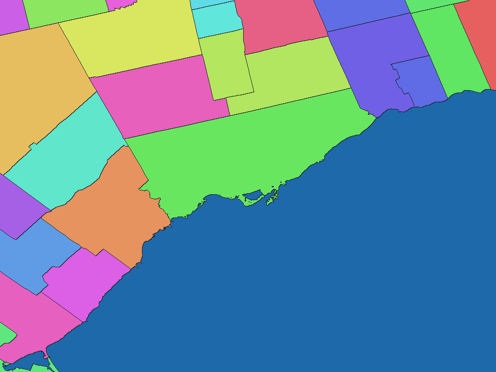

# Canadian census subdivisions, 2021

English | [日本語](ca-2021-statcan-gc-ca-csd-cbf-stat-csd.ja.md)

[Back to dataset index](../../datasets/README.md)

## Overview

Statistics Canada Census Subdivision Cartographic Boundary File. Covers municipalities and statistical municipal equivalents. Dictionary slots are [province or territory, CSD name, CSD type]. Use names.csv for source identifiers, including areas with matching names.

## Area counts

There are **5,154 areas by dictionary code** (GisWordBook leaf records). This is not a count of parent areas, polygons, or areas represented by pixels at each resolution.

There are 5,161 adopted CSDs and 5,154 dictionary records. Some source areas share a dictionary code, so the source-area and dictionary-record counts differ.

## Download

[Download ca-2021-statcan-gc-ca-csd-cbf-stat-csd.zip (25.69 MiB)](https://github.com/nyatla/galuchat-gis-sdk/releases/download/v0.2.1/ca-2021-statcan-gc-ca-csd-cbf-stat-csd.zip)

## Map resolutions and sizes

| unitInv | Approx. pixel distance | WGSMapSet size |
| ---: | ---: | ---: |
| 100 | approx. 1.1 km | 250.1 KiB |
| 1000 (default) | approx. 111 m | 2.55 MiB |
| 10000 | approx. 11 m | 24.29 MiB |

## Dictionaries

| GisWordBook encoding | Size |
| --- | ---: |
| UTF-8 | 110.5 KiB |
| UTF-16LE | 110.6 KiB |

See the included `names.csv` for source area identifiers.

### GisWordBook structure

Each record is a fixed-length StringSet with 3 slots in the order below. Empty values are retained as `""`; later slots are not shifted forward.

| Position | Slot | Meaning | Empty values |
| ---: | --- | --- | --- |
| 1 | Area 1 | English province / territory name corresponding to `PRUID` | Required |
| 2 | Area 2 | Source English census-subdivision name (`CSDNAME`) | Required |
| 3 | Attribute 1 | Census-subdivision type (`CSDTYPE`) | Required |

The order is province/territory, CSD name, then type; the type is an attribute, not a parent area. There are no Canada or Census Division slots. Matching paths can have separate codes; where a code is shared, use `CSDUID` in `names.csv` for individual identification.

Example from the actual data (dictionary code `2735`):

```json
["Ontario","Toronto","C"]
```

Nonzero map values are dictionary codes. This example corresponds to zero-based leaf-record index `2734`. Code `0` denotes unset areas, not a dictionary record.

## Rendering example

<a href="../../docs/image/ca-admin-statcan-csd-2021-unit-inv-1000.png"></a>

The image is centered around Toronto and rendered at `unitInv=1000`. Blue denotes unset areas; other colors distinguish area codes and have no semantic meaning.

## License and terms of use

Source: Statistics Canada [2021 Census Boundary Files](https://www12.statcan.gc.ca/census-recensement/2021/geo/sip-pis/boundary-limites/index2021-eng.cfm?year=21)

Original-data license / terms: [Open Government Licence – Canada 2.0](https://open.canada.ca/en/open-government-licence-canada)

This package adapts the source for Galuchat. For the processed data's terms of use, refer to the official terms above and the ZIP's `NOTICE.md`.

### Commercial use and permission applications (informational)

- Commercial use: The Open Government Licence – Canada permits commercial use subject to its terms. [Official guidance](https://open.canada.ca/en/open-government-licence-canada)
- Permission applications: An individual permission application is generally unnecessary for data uses covered by the license. [Official guidance](https://open.canada.ca/en/open-government-licence-canada)

This explanation is informational, not a formal grant of permission or a legal determination. Check the official terms and NOTICE yourself for the conditions and application requirements applicable to your intended use; contact the provider if anything is unclear.

### Attribution, modification and approval notices

Attribution and modification notices recorded in the NOTICE (original wording):

> Contains information licensed under the Open Government Licence – Canada.
>
> Derived and processed by the Galuchat project. This product is not endorsed by Statistics Canada or the Government of Canada.

## Usage notes

Always use a map and dictionary from the same ZIP. Typically choose one WGSMapSet at a suitable resolution and the UTF-8 dictionary. Pixel value 0 denotes an unset area. Sizes are actual file sizes, not runtime memory usage. Pixel distances are approximate north-south distances.

See the ZIP's `data-spec.md` for coverage, names, attributes and limitations, and `NOTICE.md` for sources, processing, attribution and terms of use.
