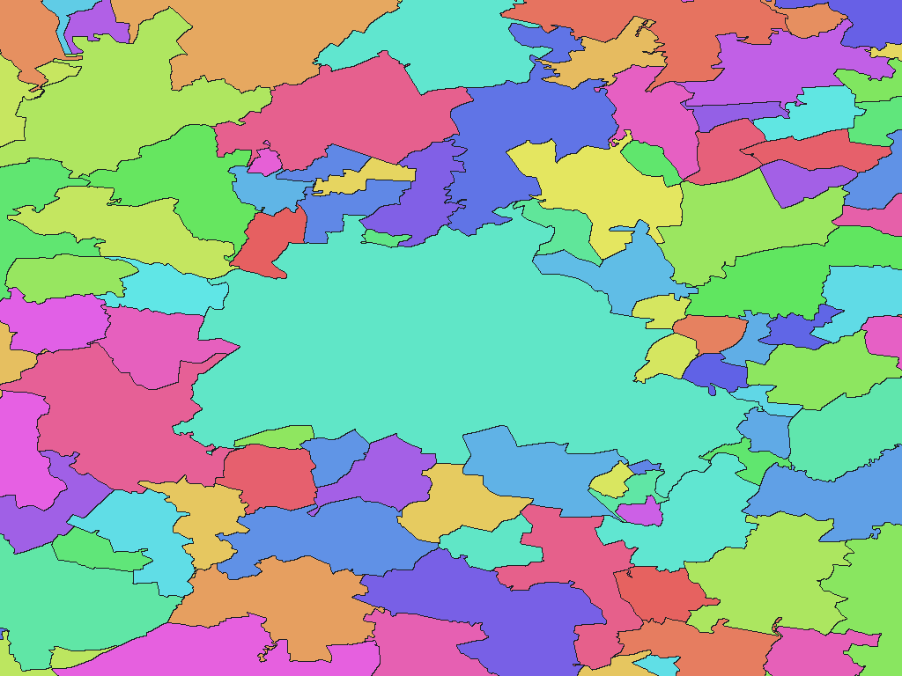

# German administrative areas, VG250 2026

English | [日本語](de-2026-gdz-bkg-bund-de-vg250-adm.ja.md)

[Back to dataset index](../../datasets/README.md)

## Overview

BKG Verwaltungsgebiete 1:250 000, as of 2026-01-01. Covers Gemeinden and gemeindefreie Gebiete. Unincorporated areas remain distinct from municipalities with the same name; source AGS identifiers are in names.csv.

## Area counts

There are **10,939 areas by dictionary code** (GisWordBook leaf records). This is not a count of parent areas, polygons, or areas represented by pixels at each resolution.

There are 10,939 adopted municipalities / unincorporated areas.

## Download

[Download de-2026-gdz-bkg-bund-de-vg250-adm.zip (7.96 MiB)](https://github.com/nyatla/galuchat-gis-sdk/releases/download/v0.2.1/de-2026-gdz-bkg-bund-de-vg250-adm.zip)

## Map resolutions and sizes

| unitInv | Approx. pixel distance | WGSMapSet size |
| ---: | ---: | ---: |
| 100 | approx. 1.1 km | 124.7 KiB |
| 1000 (default) | approx. 111 m | 1015.5 KiB |
| 10000 | approx. 11 m | 6.92 MiB |

## Dictionaries

| GisWordBook encoding | Size |
| --- | ---: |
| UTF-8 | 193.7 KiB |
| UTF-16LE | 193.6 KiB |

See the included `names.csv` for source area identifiers.

### GisWordBook structure

Each record is a fixed-length StringSet with 6 slots in the order below. Empty values are retained as `""`; later slots are not shifted forward.

| Position | Slot | Meaning | Empty values |
| ---: | --- | --- | --- |
| 1 | Area 1 | Land (`LAND_NAME`) | Required |
| 2 | Area 2 | Regierungsbezirk (`RBZ_NAME`) | Empty if absent |
| 3 | Area 3 | Kreis / Kreisfreie Stadt (`KRS_NAME`) | Required |
| 4 | Area 4 | Verwaltungsgemeinschaft or corresponding source grouping (`VWG_NAME`) | Empty if absent |
| 5 | Area 5 | Gemeinde / Gemeindefreies Gebiet (`GEM_NAME`) | Required |
| 6 | Attribute 1 | `GEM_TYPE`: `Gemeinde`, `Stadt` or `Gemeindefreies Gebiet` | Required |

Area 4 also retains source groupings for independent municipalities, unified municipalities and unincorporated areas. Repeated names in slots 3–5 do not imply membership in several actual organizations. Original spelling is preserved; no Deutschland slot, source codes or synthetic suffixes are added. Identical area-name paths with different types have separate dictionary codes.

Example from the actual data (dictionary code `8565`):

```json
["Berlin","","Berlin","Berlin","Berlin","Stadt"]
```

Nonzero map values are dictionary codes. This example corresponds to zero-based leaf-record index `8564`. Code `0` denotes unset areas, not a dictionary record.

## Rendering example

<a href="../../docs/image/de-admin-vg250-2026-unit-inv-1000.png"></a>

The image is centered around Berlin and rendered at `unitInv=1000`. Blue denotes unset areas; other colors distinguish area codes and have no semantic meaning.

## License and terms of use

Source: Bundesamt für Kartographie und Geodäsie (BKG), [VG250](https://gdz.bkg.bund.de/index.php/default/open-data/verwaltungsgebiete-1-250-000-stand-01-01-vg250-01-01.html)

Original-data license / terms: [Datenlizenz Deutschland – Namensnennung – Version 2.0（dl-de/by-2-0）](https://www.govdata.de/dl-de/by-2-0); [Product terms](https://sgx.geodatenzentrum.de/web_public/gdz/lizenz/deu/nutzungsbedingungen_vg250.pdf)

This package adapts the source for Galuchat. For the processed data's terms of use, refer to the official terms above and the ZIP's `NOTICE.md`.

### Commercial use and permission applications (informational)

- Commercial use: dl-de/by-2-0 permits commercial use subject to its terms. [Official guidance](https://www.govdata.de/dl-de/by-2-0)
- Permission applications: An individual permission application is generally unnecessary for data uses covered by the license. [Official guidance](https://www.govdata.de/dl-de/by-2-0)

This explanation is informational, not a formal grant of permission or a legal determination. Check the official terms and NOTICE yourself for the conditions and application requirements applicable to your intended use; contact the provider if anything is unclear.

### Attribution, modification and approval notices

Attribution and modification notices recorded in the NOTICE (original wording):

> © [BKG](https://www.bkg.bund.de) 2026 [dl-de/by-2-0](https://www.govdata.de/dl-de/by-2-0), Datenquellen: [https://sgx.geodatenzentrum.de/web_public/gdz/datenquellen/datenquellen_vg_nuts.pdf](https://sgx.geodatenzentrum.de/web_public/gdz/datenquellen/datenquellen_vg_nuts.pdf)
>
> Derived and processed by Galuchat. Not endorsed by BKG.

## Usage notes

Always use a map and dictionary from the same ZIP. Typically choose one WGSMapSet at a suitable resolution and the UTF-8 dictionary. Pixel value 0 denotes an unset area. Sizes are actual file sizes, not runtime memory usage. Pixel distances are approximate north-south distances.

See the ZIP's `data-spec.md` for coverage, names, attributes and limitations, and `NOTICE.md` for sources, processing, attribution and terms of use.
