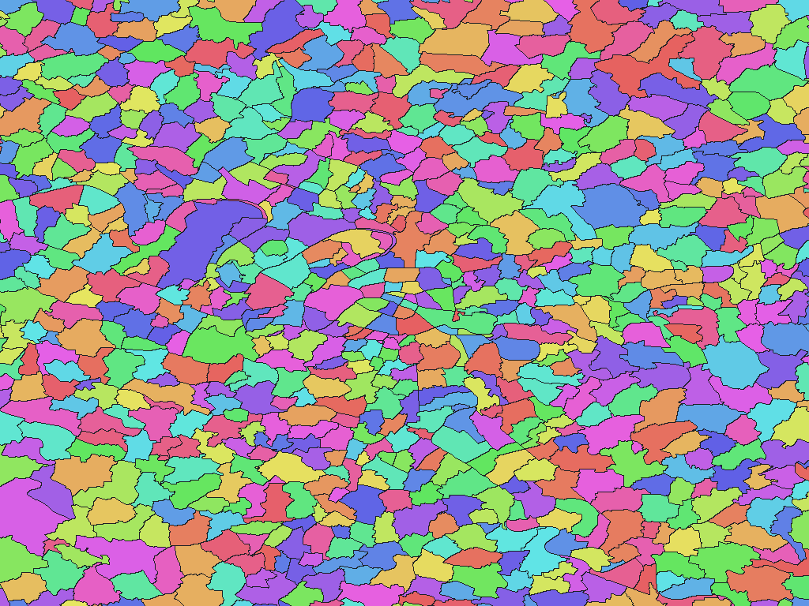

# フランス行政区域 ADMIN EXPRESS COG 2026年版

[English](fr-2026-cartes-gouv-fr-admin-express-cog-adm.md) | 日本語

[データセット一覧へ戻る](../../datasets/README.ja.md)

## 概要

IGNのADMIN EXPRESS COG 4.0（2026-01-01版）の行政区域を、GisWordBookコードで参照する区域図と名称辞書として収録する。通常のCommuneはCommune単位、Paris・Lyon・MarseilleはArrondissement municipal単位で表す。区域図の非ゼロ画素値は同梱辞書のコードであり、原典のINSEEコードとの対応はnames.csvで確認できる。

## 区域数

区域数（辞書コード単位）は **34,919件** です。これはGisWordBookの葉レコード数であり、上位区域数・ポリゴン数・各解像度で実際に画素化される区域数ではありません。

採用するCommune・Arrondissement municipalは34,919区域です。本版では同じ名称パスによる辞書コードの集約はありません。

## ダウンロード

[ダウンロード fr-2026-cartes-gouv-fr-admin-express-cog-adm.zip (18.56 MiB)](https://github.com/nyatla/galuchat-gis-sdk/releases/download/v0.2.1/fr-2026-cartes-gouv-fr-admin-express-cog-adm.zip)

## 地図の解像度とサイズ

| unitInv | 1画素の目安 | WGSMapSetサイズ |
| ---: | ---: | ---: |
| 100 | 約1.1 km | 300.5 KiB |
| 1000（標準） | 約111 m | 2.22 MiB |
| 10000 | 約11 m | 15.60 MiB |

## 名称辞書

| GisWordBook文字コード | サイズ |
| --- | ---: |
| UTF-8 | 578.5 KiB |
| UTF-16LE | 578.3 KiB |

原典の区域識別子との対応は同梱の `names.csv` を参照してください。

### GisWordBookの構造

各レコードは4スロットの固定長StringSetです。下表の順に値が並びます。空欄は `""` として保持し、後続スロットを前へ詰めません。

| スロット | 意味 | 省略可否 |
| --- | --- | --- |
| 区域1 | Régionの原典名称。 | 可 |
| 区域2 | Départementの原典名称。 | 可 |
| 区域3 | Communeの原典名称。市内行政区の場合は親Commune名。 | 不可 |
| 区域4 | Arrondissement municipalの原典名称。 | 可 |

スロットは省略可能な名称がなくても詰めずに4個を保持し、空文字列を格納する。通常Communeは`[RGN_NAME, DEP_NAME, COM_NAME, ""]`、市内行政区は`[RGN_NAME, DEP_NAME, COM_NAME, ARR_NAME]`となる。Saint-Pierre-et-Miquelonの2区域は`["", "", COM_NAME, ""]`となる。

共通の国名`France`やINSEEコードはStringSetに含めない。名称は原典のフランス語表記を保持する。同名判定は区域1〜4の全名称パスの組で行い、区域3だけが同名でも集約しない。現在の採用区域には全名称パスの重複はない。

実データの例（辞書コード `135`）：

```json
["Île-de-France","Paris","Paris","Paris 4e Arrondissement"]
```

地図の非ゼロ値が辞書コードです。この例は葉レコードの0始まりインデックス `134` に対応します。コード `0` は未設定領域で、辞書レコードではありません。

## 表示例

<a href="../../docs/image/fr-admin-express-cog-2026-unit-inv-1000.png"></a>

パリ周辺を中心に、`unitInv=1000` の地図を描画しています。青色は未設定領域、その他の色は区域コードを表します。色自体に意味はありません。

## ライセンスと利用条件

原典：Institut national de l'information géographique et forestière（IGN）[ADMIN EXPRESS COG](https://cartes.gouv.fr/rechercher-une-donnee/dataset/IGNF_ADMIN-EXPRESS)

原典ライセンス・利用条件：[Licence Ouverte / Open Licence 2.0（Etalab）](https://www.etalab.gouv.fr/wp-content/uploads/2017/04/ETALAB-Licence-Ouverte-v2.0.pdf)

本パッケージは原典をGaluchat用に加工したものです。加工済みデータの利用条件は、上記の公式規約およびZIP内の `NOTICE.md` を参照してください。

### 商用利用・許諾申請（参考）

- 商用利用：Licence Ouverte 2.0は、条件に従う商用利用を認めています。 [公式説明](https://www.etalab.gouv.fr/wp-content/uploads/2017/04/ETALAB-Licence-Ouverte-v2.0.pdf)
- 許諾申請：ライセンスが許諾するデータ利用の範囲内では、個別の利用許諾申請は原則不要です。 [公式説明](https://www.etalab.gouv.fr/wp-content/uploads/2017/04/ETALAB-Licence-Ouverte-v2.0.pdf)

この説明は参考情報であり、正式な利用許諾や法的判断を示すものではありません。実際の利用方法に適用される条件・申請の要否は、利用者自身で公式規約とNOTICEを確認し、不明な場合は提供元へお問い合わせください。

### 出典・加工・承認表示

NOTICEに記載された出典・加工表示：

> Source: IGN, ADMIN EXPRESS COG 4.0, edition 2026-01-01.
>
> Derived and processed by Galuchat. Not endorsed by IGN or INSEE.

## 利用にあたって

地図と辞書は必ず同じZIPの組み合わせを使用してください。通常は用途に合うWGSMapSetを1つとUTF-8辞書を選びます。画素値0は未設定領域です。サイズは実ファイルサイズであり、実行時のメモリ使用量ではありません。1画素の距離は緯度方向の概算です。

データの対象範囲、名称・属性、制約はZIP内の `data-spec.md`、出典、加工内容、帰属表示、利用条件は `NOTICE.md` を参照してください。
