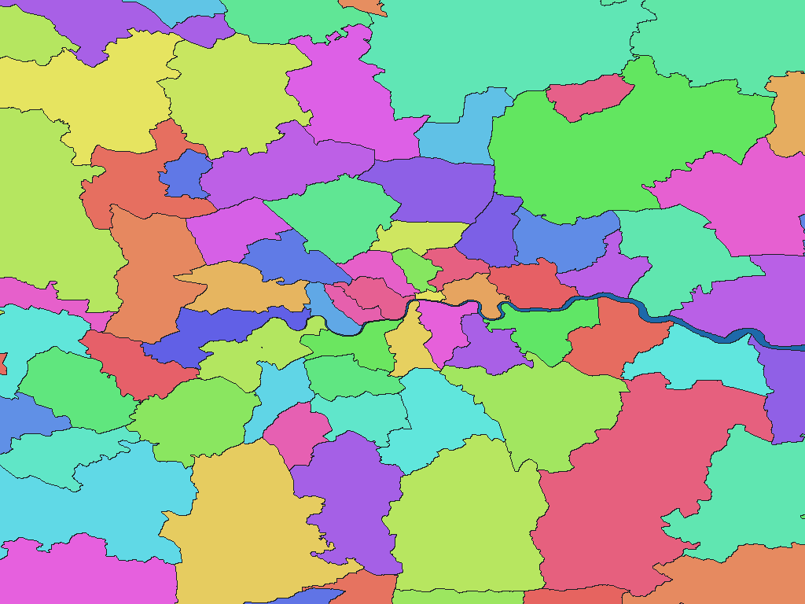

# 英国地方自治体地区 2025年12月版

[English](gb-2025-geoportal-statistics-gov-uk-lad-adm-bfc.md) | 日本語

[データセット一覧へ戻る](../../datasets/README.ja.md)

## 概要

英国の2025年12月時点のLocal Authority District（LAD）境界を、Galuchat用の行政区域図とGisWordBookとして収録する。区域図の画素値は同梱GisWordBookのコードであり、原典のGSSコードや名称は同梱の名称表から参照できる。

## 区域数

区域数（辞書コード単位）は **361件** です。これはGisWordBookの葉レコード数であり、上位区域数・ポリゴン数・各解像度で実際に画素化される区域数ではありません。

LADは361区域（England 296、Scotland 32、Wales 22、Northern Ireland 11）です。

## ダウンロード

[ダウンロード gb-2025-geoportal-statistics-gov-uk-lad-adm-bfc.zip (2.36 MiB)](https://github.com/nyatla/galuchat-gis-sdk/releases/download/v0.2.1/gb-2025-geoportal-statistics-gov-uk-lad-adm-bfc.zip)

## 地図の解像度とサイズ

| unitInv | 1画素の目安 | WGSMapSetサイズ |
| ---: | ---: | ---: |
| 100 | 約1.1 km | 19.8 KiB |
| 1000（標準） | 約111 m | 210.7 KiB |
| 10000 | 約11 m | 2.23 MiB |

## 名称辞書

| GisWordBook文字コード | サイズ |
| --- | ---: |
| UTF-8 | 6.2 KiB |
| UTF-16LE | 6.3 KiB |

原典の区域識別子との対応は同梱の `names.csv` を参照してください。

### GisWordBookの構造

各レコードは3スロットの固定長StringSetです。下表の順に値が並びます。空欄は `""` として保持し、後続スロットを前へ詰めません。

| スロット | 意味 | 省略可否 |
| --- | --- | --- |
| 区域1 | 構成国名（England、Scotland、Wales、Northern Ireland） | 不可 |
| 区域2 | 上位の行政County名。 | 可。該当しない場合は空文字列`""`。 |
| 区域3 | `LAD25NM`による英語の区域名。 | 不可 |

共通のUnited Kingdomノードは置かない。同名の区域は、3スロットを組み合わせたパスおよび`names.csv`のGSSコードで識別する。ウェールズ語名はStringSetには含めず、`names.csv`の`LAD25NMW`に保持する。

実データの例（辞書コード `296`）：

```json
["England","","Westminster"]
```

地図の非ゼロ値が辞書コードです。この例は葉レコードの0始まりインデックス `295` に対応します。コード `0` は未設定領域で、辞書レコードではありません。

## 表示例

<a href="../../docs/image/uk-admin-ons-lad-2025-unit-inv-1000.png"></a>

ロンドン周辺を中心に、`unitInv=1000` の地図を描画しています。青色は未設定領域、その他の色は区域コードを表します。色自体に意味はありません。

## ライセンスと利用条件

原典：Office for National Statistics（ONS）[LAD境界](https://www.data.gov.uk/dataset/aa5a9ccf-fbea-43cb-81cc-fdc04d89f128/local-authority-districts-december-2025-boundaries-uk-bfc)と[LAD・County対応表](https://www.data.gov.uk/dataset/a76a9de2-d0f4-4fd7-bcc9-e63bbf28bbb5/local-authority-district-to-county-and-unitary-authority-april-2025-lookup-in-ew-v2)

原典ライセンス・利用条件：[Open Government Licence v3.0](https://www.nationalarchives.gov.uk/doc/open-government-licence/version/3/)、[ONSライセンス案内](https://www.ons.gov.uk/methodology/geography/licences)

本パッケージは原典をGaluchat用に加工したものです。加工済みデータの利用条件は、上記の公式規約およびZIP内の `NOTICE.md` を参照してください。

### 商用利用・許諾申請（参考）

- 商用利用：ONSは、Open Government Licenceの条件に従う商用利用を認めています。 [公式説明](https://www.ons.gov.uk/methodology/geography/licences)
- 許諾申請：ONSは、規約の範囲内では個別のライセンス申請なしに利用できると案内しています。 [公式説明](https://www.ons.gov.uk/methodology/geography/licences)

この説明は参考情報であり、正式な利用許諾や法的判断を示すものではありません。実際の利用方法に適用される条件・申請の要否は、利用者自身で公式規約とNOTICEを確認し、不明な場合は提供元へお問い合わせください。

### 出典・加工・承認表示

NOTICEに記載された出典・加工表示：

> Source: Office for National Statistics licensed under the Open Government Licence v.3.0
>
> Contains OS data © Crown copyright and database right 2026

## 利用にあたって

地図と辞書は必ず同じZIPの組み合わせを使用してください。通常は用途に合うWGSMapSetを1つとUTF-8辞書を選びます。画素値0は未設定領域です。サイズは実ファイルサイズであり、実行時のメモリ使用量ではありません。1画素の距離は緯度方向の概算です。

データの対象範囲、名称・属性、制約はZIP内の `data-spec.md`、出典、加工内容、帰属表示、利用条件は `NOTICE.md` を参照してください。
