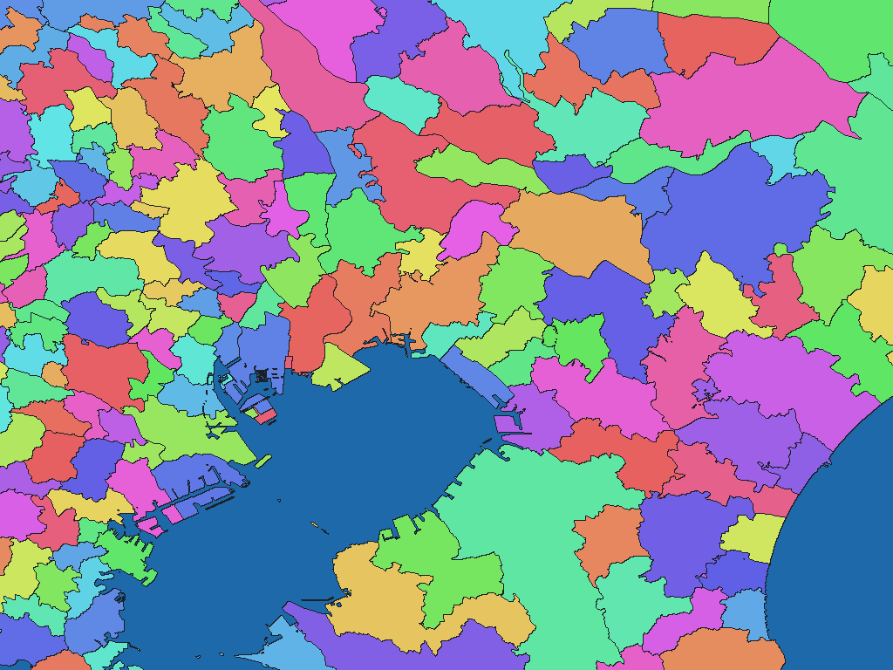

# Japanese administrative areas, 2025

English | [日本語](jp-2025-mlit-go-jp-n03-adm.ja.md)

[Back to dataset index](../../datasets/README.md)

## Overview

MLIT National Land Numerical Information N03, as of 2025-01-01. Provides prefectures, municipalities, counties and designated-city wards.

## Area counts

There are **1,905 areas by dictionary code** (GisWordBook leaf records). This is not a count of parent areas, polygons, or areas represented by pixels at each resolution.

This figure describes dictionary entries and is distinct from a source-area count.

## Download

[Download jp-2025-mlit-go-jp-n03-adm.zip (4.81 MiB)](https://github.com/nyatla/galuchat-gis-sdk/releases/download/v0.2.1/jp-2025-mlit-go-jp-n03-adm.zip)

## Map resolutions and sizes

| unitInv | Approx. pixel distance | WGSMapSet size |
| ---: | ---: | ---: |
| 100 | approx. 1.1 km | 51.7 KiB |
| 1000 (default) | approx. 111 m | 478.9 KiB |
| 10000 | approx. 11 m | 4.48 MiB |

## Dictionaries

| GisWordBook encoding | Size |
| --- | ---: |
| UTF-8 | 31.2 KiB |
| Shift_JIS | 30.3 KiB |
| UTF-16LE | 30.4 KiB |

### GisWordBook structure

Each record is a fixed-length StringSet with 5 slots in the order below. Empty values are retained as `""`; later slots are not shifted forward.

| Position | Slot | Meaning | Empty values |
| ---: | --- | --- | --- |
| 1 | Area 1 | Prefecture (`N03_001`) | Required |
| 2 | Area 2 | Subprefecture (`N03_002`) | Empty if absent |
| 3 | Area 3 | District / gun (`N03_003`) | Empty if absent |
| 4 | Area 4 | Municipality (`N03_004`) | Required |
| 5 | Area 5 | Ward of a designated city (`N03_005`) | Empty if absent |

There is no shared country-name slot. Identical display names can have different dictionary codes. The three encodings preserve the same record order, codes and logical values.

Example from the actual data (dictionary code `672`):

```json
["東京都","","","千代田区",""]
```

Nonzero map values are dictionary codes. This example corresponds to zero-based leaf-record index `671`. Code `0` denotes unset areas, not a dictionary record.

## Rendering example

<a href="../../docs/image/jp-admin-n03-2025-unit-inv-1000.png"></a>

The image is centered around Narashino and rendered at `unitInv=1000`. Blue denotes unset areas; other colors distinguish area codes and have no semantic meaning.

## License and terms of use

Source: MLIT [National Land Numerical Information administrative-area dataset N03-20250101](https://nlftp.mlit.go.jp/ksj/gml/datalist/KsjTmplt-N03-2025.html)

Original-data license / terms: [CC BY 4.0](https://creativecommons.org/licenses/by/4.0/); [Download-site terms](https://nlftp.mlit.go.jp/ksj/other/agreement.html)

This package adapts the source for Galuchat. For the processed data's terms of use, refer to the official terms above and the ZIP's `NOTICE.md`.

### Commercial use and permission applications (informational)

- Commercial use: CC BY 4.0 permits commercial use subject to its terms. [Official guidance](https://creativecommons.org/licenses/by/4.0/)
- Permission applications: No individual application to the copyright holder is needed for uses covered by CC BY 4.0. Survey Act procedures are separate: GSI states that secondary use of use-approved products requires no application, provided the party that obtained the approval has permitted the reuse. [Official guidance](https://service.gsi.go.jp/onestop/navi/nav3/)

This explanation is informational, not a formal grant of permission or a legal determination. Check the official terms and NOTICE yourself for the conditions and application requirements applicable to your intended use; contact the provider if anything is unclear.

### Attribution, modification and approval notices

Attribution and modification notices recorded in the NOTICE (original wording):

> 出典：国土交通省国土数値情報ダウンロードサイト（https://nlftp.mlit.go.jp/ksj/gml/datalist/KsjTmplt-N03-2025.html）
>
> 「国土数値情報（行政区域データ）」（国土交通省）をもとにGaluchat用に加工して作成

Approval notice recorded in the NOTICE for WGSMapSet files and `X7115_metadata.xml`:

> 測量法に基づく国土地理院長承認（使用）R 8JHs 319

## Usage notes

Always use a map and dictionary from the same ZIP. Typically choose one WGSMapSet at a suitable resolution and the UTF-8 dictionary. Pixel value 0 denotes an unset area. Sizes are actual file sizes, not runtime memory usage. Pixel distances are approximate north-south distances.

See the ZIP's `data-spec.md` for coverage, names, attributes and limitations, and `NOTICE.md` for sources, processing, attribution and terms of use.
