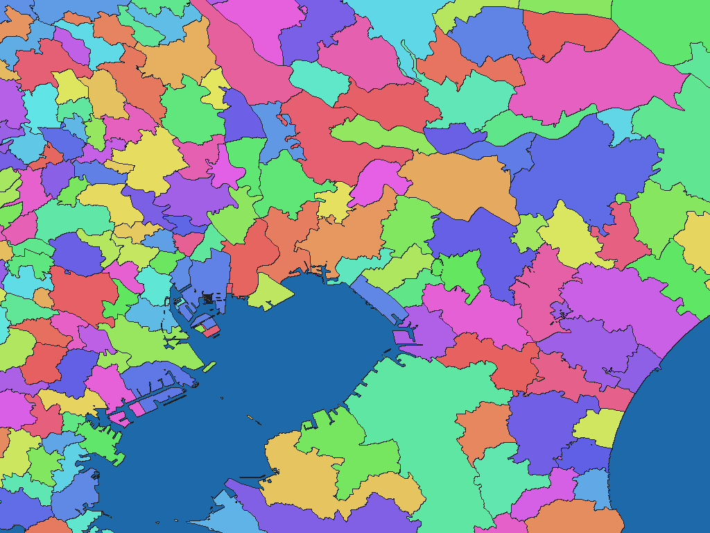

# 日本行政区域 2026年版

[English](jp-2026-mlit-go-jp-n03-adm.md) | 日本語

[データセット一覧へ戻る](../../datasets/README.ja.md)

## 概要

本データセットは、国土交通省が提供する「国土数値情報（行政区域データ）N03-20260101」を、Galuchatのオフライン逆ジオコーディング用に加工したリリースパッケージである。日本全国の行政区域を、WGSMapSet/3の区域地図とGisWordBook/0の名称辞書として提供する。

## 区域数

区域数（辞書コード単位）は **1,905件** です。これはGisWordBookの葉レコード数であり、上位区域数・ポリゴン数・各解像度で実際に画素化される区域数ではありません。

この値は辞書収録項目の数として示しており、原典の区域数とは区別します。

## ダウンロード

[ダウンロード jp-2026-mlit-go-jp-n03-adm.zip (4.81 MiB)](https://github.com/nyatla/galuchat-gis-sdk/releases/download/v0.2.1/jp-2026-mlit-go-jp-n03-adm.zip)

## 地図の解像度とサイズ

| unitInv | 1画素の目安 | WGSMapSetサイズ |
| ---: | ---: | ---: |
| 100 | 約1.1 km | 51.7 KiB |
| 1000（標準） | 約111 m | 478.8 KiB |
| 10000 | 約11 m | 4.47 MiB |

## 名称辞書

| GisWordBook文字コード | サイズ |
| --- | ---: |
| UTF-8 | 31.2 KiB |
| Shift_JIS | 30.3 KiB |
| UTF-16LE | 30.4 KiB |

### GisWordBookの構造

各レコードは5スロットの固定長StringSetです。下表の順に値が並びます。空欄は `""` として保持し、後続スロットを前へ詰めません。

GisWordBookの各レコードは次の5スロットの固定長パスを持つ。国名などの共通ノードは含めない。存在しない振興局、郡または政令指定都市の行政区は空文字列`""`とする。

| スロット | 意味 | 省略可否 |
| --- | --- | --- |
| 区域1 | 都道府県。`N03_001`の名称。 | 不可 |
| 区域2 | 振興局。`N03_002`の名称。 | 可。存在しない場合は空文字列。 |
| 区域3 | 郡。`N03_003`の名称。 | 可。存在しない場合は空文字列。 |
| 区域4 | 市区町村。`N03_004`の名称。 | 不可 |
| 区域5 | 政令指定都市の行政区。`N03_005`の名称。 | 可。存在しない場合は空文字列。 |

同じ表示名の区域が複数存在する場合も、GisWordBookコードで区別する。3種類のGisWordBookは文字エンコーディングだけが異なり、レコード順序、コードおよび論理内容は同一である。

実データの例（辞書コード `672`）：

```json
["東京都","","","千代田区",""]
```

地図の非ゼロ値が辞書コードです。この例は葉レコードの0始まりインデックス `671` に対応します。コード `0` は未設定領域で、辞書レコードではありません。

## 表示例

<a href="../../docs/image/jp-admin-n03-2026-unit-inv-1000.png"></a>

習志野市周辺を中心に、`unitInv=1000` の地図を描画しています。青色は未設定領域、その他の色は区域コードを表します。色自体に意味はありません。

## ライセンスと利用条件

原典：国土交通省 [国土数値情報（行政区域データ）N03-20260101](https://nlftp.mlit.go.jp/ksj/gml/datalist/KsjTmplt-N03-2026.html)

原典ライセンス・利用条件：[CC BY 4.0](https://creativecommons.org/licenses/by/4.0/)、[国土数値情報サイト利用規約](https://nlftp.mlit.go.jp/ksj/other/agreement.html)

本パッケージは原典をGaluchat用に加工したものです。加工済みデータの利用条件は、上記の公式規約およびZIP内の `NOTICE.md` を参照してください。

### 商用利用・許諾申請（参考）

- 商用利用：CC BY 4.0は、ライセンス条件に従う商用利用を認めています。 [公式説明](https://creativecommons.org/licenses/by/4.0/)
- 許諾申請：CC BY 4.0の許諾範囲内では、著作権者への個別申請は不要です。測量法上の申請は別の扱いで、国土地理院は使用承認済み成果品の二次利用について、承認を得た者からの許諾を前提に申請不要と案内しています。 [公式説明](https://service.gsi.go.jp/onestop/navi/nav3/)

この説明は参考情報であり、正式な利用許諾や法的判断を示すものではありません。実際の利用方法に適用される条件・申請の要否は、利用者自身で公式規約とNOTICEを確認し、不明な場合は提供元へお問い合わせください。

### 出典・加工・承認表示

NOTICEに記載された出典・加工表示：

> 出典：国土交通省国土数値情報ダウンロードサイト（https://nlftp.mlit.go.jp/ksj/gml/datalist/KsjTmplt-N03-2026.html）
>
> 「国土数値情報（行政区域データ）」（国土交通省）をもとにGaluchat用に加工して作成

WGSMapSetと `X7115_metadata.xml` について、NOTICEに記載された承認表示：

> 測量法に基づく国土地理院長承認（使用）R 8JHs 319

## 利用にあたって

地図と辞書は必ず同じZIPの組み合わせを使用してください。通常は用途に合うWGSMapSetを1つとUTF-8辞書を選びます。画素値0は未設定領域です。サイズは実ファイルサイズであり、実行時のメモリ使用量ではありません。1画素の距離は緯度方向の概算です。

データの対象範囲、名称・属性、制約はZIP内の `data-spec.md`、出典、加工内容、帰属表示、利用条件は `NOTICE.md` を参照してください。
