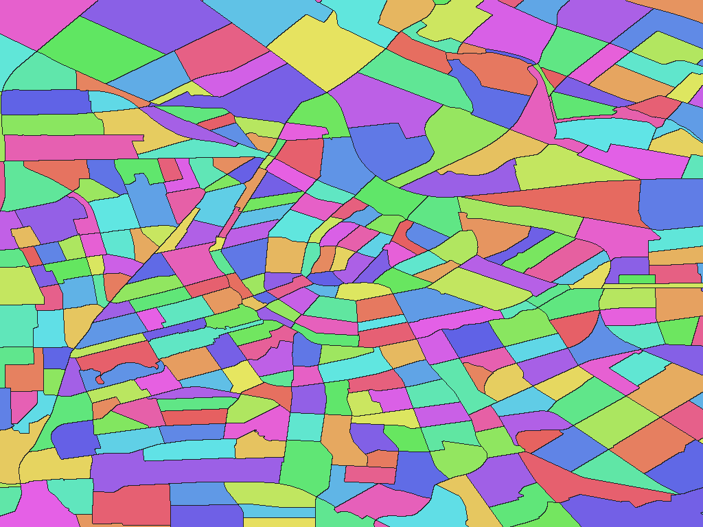

# Dutch districts and neighbourhoods, 2026

English | [日本語](nl-2026-cbs-nl-wijkbuurtkaart-stat-buurt.ja.md)

[Back to dataset index](../../datasets/README.md)

## Overview

CBS Wijk- en Buurtkaart 2026 versie 0 neighbourhoods. Provides province, municipality, district (Wijk) and neighbourhood (Buurt) names for European Netherlands, retaining WATER attributes. Matching paths and WATER attributes share dictionary codes; source identifiers are in names.csv.

## Area counts

There are **14,910 areas by dictionary code** (GisWordBook leaf records). This is not a count of parent areas, polygons, or areas represented by pixels at each resolution.

There are 14,913 adopted surfaces and 14,910 dictionary records. Three pairs of distinct Buurt codes with matching name paths and WATER values are merged into shared dictionary codes.

## Download

[Download nl-2026-cbs-nl-wijkbuurtkaart-stat-buurt.zip (3.62 MiB)](https://github.com/nyatla/galuchat-gis-sdk/releases/download/v0.2.1/nl-2026-cbs-nl-wijkbuurtkaart-stat-buurt.zip)

## Map resolutions and sizes

| unitInv | Approx. pixel distance | WGSMapSet size |
| ---: | ---: | ---: |
| 100 | approx. 1.1 km | 49.7 KiB |
| 1000 (default) | approx. 111 m | 385.1 KiB |
| 10000 | approx. 11 m | 2.49 MiB |

## Dictionaries

| GisWordBook encoding | Size |
| --- | ---: |
| UTF-8 | 389.3 KiB |
| UTF-16LE | 389.4 KiB |

See the included `names.csv` for source area identifiers.

### GisWordBook structure

Each record is a fixed-length StringSet with 5 slots in the order below. Empty values are retained as `""`; later slots are not shifted forward.

| Position | Slot | Meaning | Empty values |
| ---: | --- | --- | --- |
| 1 | Area 1 | Province (`PROV_NAME`) | Required |
| 2 | Area 2 | Municipality (`GEM_NAME`) | Required |
| 3 | Area 3 | Wijk: statistical / local district (`WIJK_NAME`) | Required |
| 4 | Area 4 | Buurt: neighbourhood (`BUURT_NAME`) | Empty if missing |
| 5 | Attribute 1 | `WATER`: `NEE` = land category; `JA` = water category | Required |

WATER is a surface attribute, not an administrative level. Missing Buurt names remain empty; none are empty in this release. Matching full name paths and WATER values share a code even when `BUURT_CODE` differs. There is no Nederland slot or source-code slot, and no synthetic names or suffixes are added.

Example from the actual data (dictionary code `4323`):

```json
["Noord-Holland","Amsterdam","Burgwallen-Oude Zijde","BG-terrein e.o.","NEE"]
```

Nonzero map values are dictionary codes. This example corresponds to zero-based leaf-record index `4322`. Code `0` denotes unset areas, not a dictionary record.

## Rendering example

<a href="../../docs/image/nl-stat-buurt-2026-unit-inv-10000.png"></a>

The image is centered around Amsterdam and rendered at `unitInv=10000`. Blue denotes unset areas; other colors distinguish area codes and have no semantic meaning.

## License and terms of use

Source: CBS / Kadaster [Wijk- en Buurtkaart 2026](https://www.cbs.nl/nl-nl/dossier/nederland-regionaal/geografische-data/wijk-en-buurtkaart-2026) and CBS [municipality-to-province table](https://www.cbs.nl/nl-nl/onze-diensten/methoden/classificaties/overig/gemeentelijke-indelingen-per-jaar/indeling-per-jaar/gemeentelijke-indeling-op-1-januari-2026)

Original-data license / terms: [Copyright policy (CC BY 4.0 unless otherwise stated)](https://www.cbs.nl/en-gb/about-us/website/copyright); [Source-attribution terms](https://www.cbs.nl/nl-nl/dossier/nederland-regionaal/geografische-data/wijk-en-buurtkaart-2026)

This package adapts the source for Galuchat. For the processed data's terms of use, refer to the official terms above and the ZIP's `NOTICE.md`.

### Commercial use and permission applications (informational)

- Commercial use: Within CC BY 4.0's scope under CBS's general policy, commercial use is permitted subject to its terms. The geographic-data page also specifies CBS / Kadaster attribution. [Official guidance](https://www.cbs.nl/en-gb/about-us/website/copyright)
- Permission applications: No individual copyright permission application is needed within CC BY 4.0's scope; check the distribution page for any specific terms. [Official guidance](https://creativecommons.org/licenses/by/4.0/)

This explanation is informational, not a formal grant of permission or a legal determination. Check the official terms and NOTICE yourself for the conditions and application requirements applicable to your intended use; contact the provider if anything is unclear.

### Attribution, modification and approval notices

Attribution and modification notices recorded in the NOTICE (original wording):

> Source: CBS and Kadaster, Wijk- en Buurtkaart 2026 versie 0.
>
> Derived and processed by Galuchat. Not endorsed by CBS or Kadaster.
>
> Source: CBS, Gemeentelijke indeling op 1 januari 2026.
>
> Derived and processed by Galuchat. Not endorsed by CBS.

## Usage notes

Always use a map and dictionary from the same ZIP. Typically choose one WGSMapSet at a suitable resolution and the UTF-8 dictionary. Pixel value 0 denotes an unset area. Sizes are actual file sizes, not runtime memory usage. Pixel distances are approximate north-south distances.

See the ZIP's `data-spec.md` for coverage, names, attributes and limitations, and `NOTICE.md` for sources, processing, attribution and terms of use.
