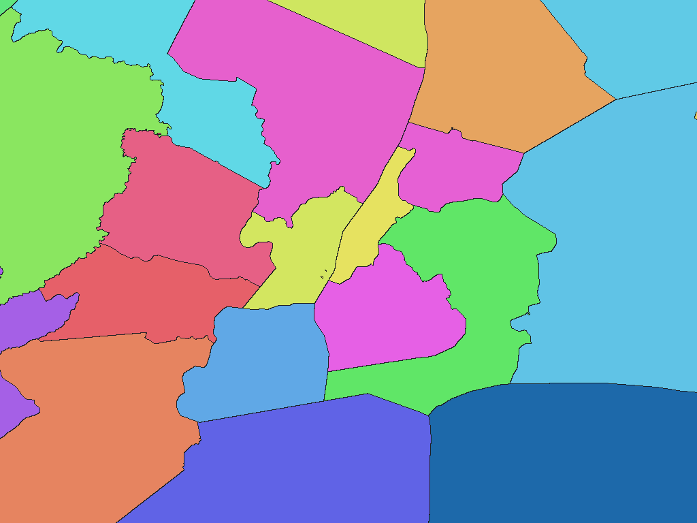

# U.S. counties and county equivalents, 2025

English | [日本語](us-2025-census-gov-tl-county-adm2.ja.md)

[Back to dataset index](../../datasets/README.md)

## Overview

U.S. Census Bureau TIGER/Line County and Equivalent Entities. Includes 3,144 counties and equivalents in the 50 states and District of Columbia; excludes Puerto Rico and Island Areas. These boundaries are not clipped to the physical coastline.

## Area counts

There are **3,144 areas by dictionary code** (GisWordBook leaf records). This is not a count of parent areas, polygons, or areas represented by pixels at each resolution.

There are 3,144 adopted counties / county equivalents.

## Download

[Download us-2025-census-gov-tl-county-adm2.zip (7.55 MiB)](https://github.com/nyatla/galuchat-gis-sdk/releases/download/v0.2.1/us-2025-census-gov-tl-county-adm2.zip)

## Map resolutions and sizes

| unitInv | Approx. pixel distance | WGSMapSet size |
| ---: | ---: | ---: |
| 100 | approx. 1.1 km | 166.1 KiB |
| 1000 (default) | approx. 111 m | 978.5 KiB |
| 10000 | approx. 11 m | 7.11 MiB |

## Dictionaries

| GisWordBook encoding | Size |
| --- | ---: |
| UTF-8 | 21.8 KiB |
| UTF-16LE | 21.8 KiB |

See the included `names.csv` for source area identifiers.

### GisWordBook structure

Each record is a fixed-length StringSet with 2 slots in the order below. Empty values are retained as `""`; later slots are not shifted forward.

| Position | Slot | Meaning | Empty values |
| ---: | --- | --- | --- |
| 1 | Area 1 | English state / state-equivalent name corresponding to `STATEFP` | Required |
| 2 | Area 2 | English county / county-equivalent name (`NAMELSAD`) | Required |

There is no shared United States slot. County names repeated across states are distinguished by the two-slot path.

Example from the actual data (dictionary code `1861`):

```json
["New York","New York County"]
```

Nonzero map values are dictionary codes. This example corresponds to zero-based leaf-record index `1860`. Code `0` denotes unset areas, not a dictionary record.

## Rendering example

<a href="../../docs/image/us-admin-census-county-2025-unit-inv-1000.png"></a>

The image is centered around New York and rendered at `unitInv=1000`. Blue denotes unset areas; other colors distinguish area codes and have no semantic meaning.

## License and terms of use

Source: U.S. Census Bureau [2025 TIGER/Line Shapefiles (county)](https://www.census.gov/geographies/mapping-files/2025/geo/tiger-line-file.html)

Original-data license / terms: [U.S. government works and TIGER/Line notices](https://www2.census.gov/geo/pdfs/maps-data/data/tiger/tgrshp2025/TGRSHP2025_TechDoc_Ch1.pdf)

This package adapts the source for Galuchat. For the processed data's terms of use, refer to the official terms above and the ZIP's `NOTICE.md`.

### Commercial use and permission applications (informational)

- Commercial use: The U.S. government data may be reused, including in commercial products. TIGER/Line trademarks are treated separately from the data. [Official guidance](https://www2.census.gov/geo/pdfs/maps-data/data/tiger/tgrshp2025/TGRSHP2025_TechDoc_Ch1.pdf)
- Permission applications: An individual copyright permission application is generally unnecessary for the original government data under U.S. law; consult the official notices for separate rights such as trademarks. [Official guidance](https://www2.census.gov/geo/pdfs/maps-data/data/tiger/tgrshp2025/TGRSHP2025_TechDoc_Ch1.pdf)

This explanation is informational, not a formal grant of permission or a legal determination. Check the official terms and NOTICE yourself for the conditions and application requirements applicable to your intended use; contact the provider if anything is unclear.

### Attribution, modification and approval notices

Attribution and modification notices recorded in the NOTICE (original wording):

> Source: U.S. Census Bureau, 2025 TIGER/Line® Shapefiles, County and Equivalent Entities.
>
> Derived and processed by the Galuchat project. This product is not endorsed by the U.S. Census Bureau.

## Usage notes

Always use a map and dictionary from the same ZIP. Typically choose one WGSMapSet at a suitable resolution and the UTF-8 dictionary. Pixel value 0 denotes an unset area. Sizes are actual file sizes, not runtime memory usage. Pixel distances are approximate north-south distances.

See the ZIP's `data-spec.md` for coverage, names, attributes and limitations, and `NOTICE.md` for sources, processing, attribution and terms of use.
